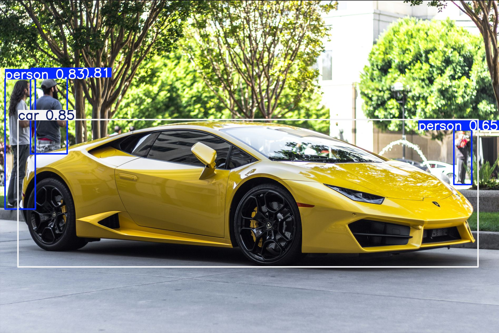
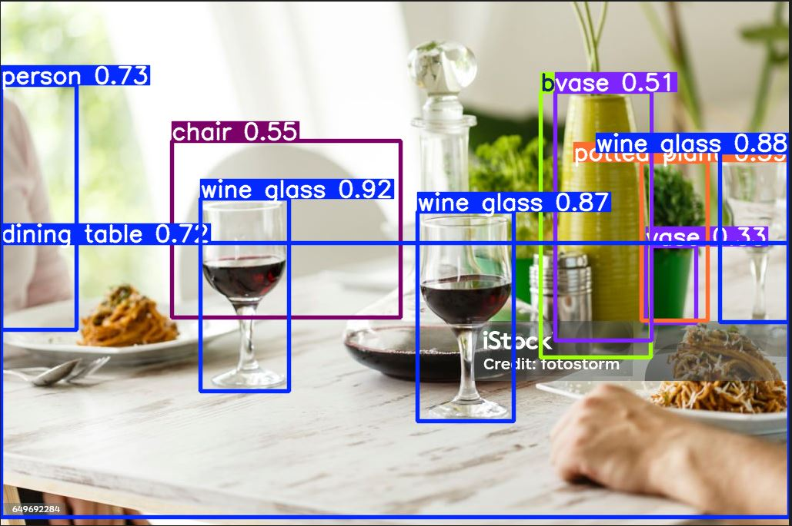
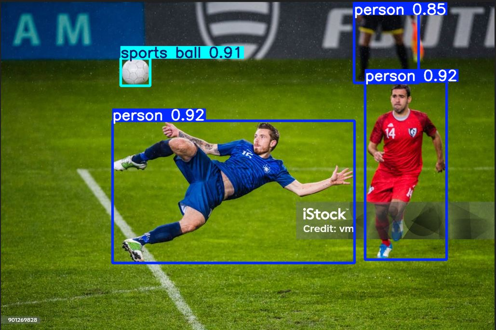
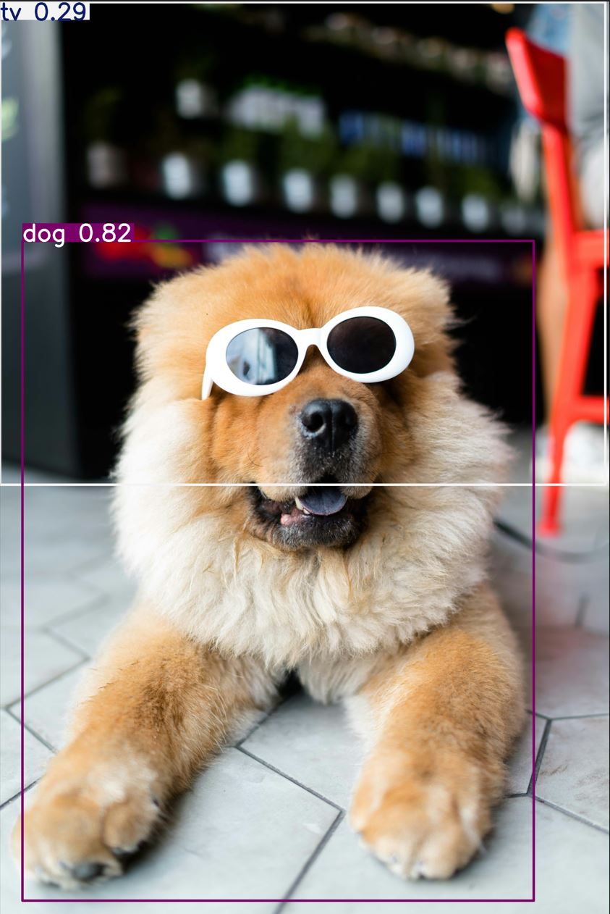

# YOLOv8-Object-Detection

---

# 🚀 Détection d'Objets en Temps Réel avec YOLOv8  

Ce projet présente une **implémentation complète de YOLOv8** pour la détection d’objets sur **images, vidéos et en temps réel**. Il inclut l’entraînement sur un **dataset personnalisé**, ainsi que l’optimisation des performances du modèle.  

---

## 📌 **Aperçu du Projet**
**YOLO (You Only Look Once)** est une architecture de réseau de neurones convolutifs (**CNN**) permettant une **détection rapide et précise des objets**. YOLOv8, développé par **Ultralytics**, améliore la vitesse, la précision et l’accessibilité du modèle.

Dans ce projet, nous avons **exploré et testé YOLOv8** sur divers cas d’utilisation, en nous concentrant sur :

✅ **Détection d’objets sur images et vidéos**  
✅ **Entraînement sur un dataset personnalisé**  
✅ **Optimisation des performances du modèle**  
✅ **Test en temps réel avec la webcam**  
✅ **Sauvegarde et visualisation des prédictions**  

🚨 **Note** : Pour des **contraintes de mémoire et de calcul**, nous avons utilisé **YOLOv8n (nano)**, un modèle léger optimisé. Nous n'avons pas testé de modèles plus grands (**YOLOv8m, YOLOv8l, YOLOv8x**), mais ceux-ci peuvent être utilisés sur du matériel plus puissant pour des performances accrues.  

📷 **Respect du RGPD** :  
Les images utilisées pour ce projet proviennent de **Unsplash**, une plateforme fournissant des images **libres de droits**. Cela permet de respecter les **normes de confidentialité** et **évite l’utilisation de données personnelles sensibles**.

## 🖼️ Aperçu des Images Testées

| Voiture | Déjeuner | Joueur | Chien |
|---------|---------|--------|------|
|  |  |  |  |

---

## 🎯 **Fonctionnalités Principales**
### 🔹 **1. Détection d’Objets sur Images**
- Chargement d'une image et application du modèle YOLOv8 pour identifier les objets.
- Visualisation des prédictions avec **bounding boxes** et **classes détectées**.

### 🔹 **2. Détection en Temps Réel avec Webcam**
- Activation de la webcam pour effectuer la détection en direct.
- Annotation des objets détectés et possibilité d’arrêter avec une touche spécifique.

### 🔹 **3. Enregistrement de Vidéos Annotées**
- Capture vidéo en temps réel avec **enregistrement des détections**.
- Sauvegarde des résultats au format vidéo pour une analyse ultérieure.

### 🔹 **4. Entraînement sur un Dataset Personnalisé**
- Annotation manuelle des images avec **LabelImg**.
- Génération et structuration des fichiers **data.yaml** et **labels**.
- Lancement de l’entraînement et évaluation des performances.

### 🔹 **5. Optimisation des Performances**
- Ajustement des **paramètres d'entraînement** (epochs, batch size, image size).
- Application d’**augmentations de données** pour améliorer la robustesse du modèle.
- Possibilité d’utiliser des modèles plus grands si les ressources matérielles le permettent.

### 🔹 **6. Conversion et Déploiement**
- Exportation du modèle vers différents formats (ONNX, TensorRT, OpenVINO).
- Intégration potentielle dans une API ou une application embarquée.

---

## 🛠️ **Technologies Utilisées**
| Technologie  | Utilisation |
|-------------|------------|
| **YOLOv8 (Ultralytics)** | Détection et entraînement du modèle |
| **OpenCV** | Manipulation des images et vidéos |
| **Python (PyTorch)** | Environnement de développement |
| **LabelImg** | Annotation des images pour l’entraînement |
| **Streamlit** (optionnel) | Déploiement interactif du modèle |

---

## ⚙️ **Installation et Configuration**
### **📌 Prérequis**
- **Python 3.8+**
- **PyTorch installé** (`pip install torch torchvision torchaudio`)
- **Ultralytics installé** (`pip install ultralytics`)
- **OpenCV installé** (`pip install opencv-python`)

### **📌 Installation**
```bash
# 1️⃣ Clonez ce dépôt
git clone https://github.com/votre_nom_utilisateur/YOLOv8-Detection.git
cd YOLOv8-Detection

# 2️⃣ Installez les dépendances
pip install -r requirements.txt
```
---

## 🚀 **Améliorations Futures**
✅ **Tester des modèles plus grands** (YOLOv8m, YOLOv8l, YOLOv8x) sur un GPU plus puissant.  
✅ **Intégrer d'autres techniques d’optimisation** (Quantization, Pruning).  
✅ **Créer une interface interactive** pour tester le modèle en direct via une application Web.  
✅ **Exporter le modèle** vers des frameworks embarqués (TensorRT, ONNX).  

---

## ✍️ **Auteur**
Projet réalisé par **Khoty WOLIE**  
📩 *N’hésitez pas à me contacter pour toute question ou suggestion !* 😊  

---
